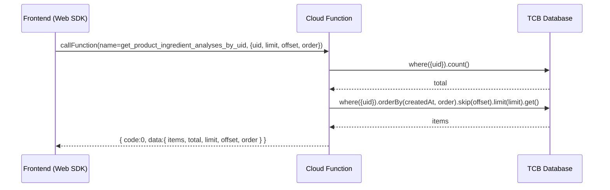

# 技术方案设计

## 概述
- 云函数名：`get_product_ingredient_analyses_by_uid`
- 目标：按 `uid` 查询 CloudBase 集合 `product_ingredient_analysis` 的记录，支持分页与排序；不包含时间范围过滤。
- 运行环境：CloudBase 云函数（Node.js，使用 `@cloudbase/node-sdk`）。

## 输入与输出
- 入参
  - `uid`：string，必填
  - `limit`：number，默认 20，范围 1-100
  - `offset`：number，默认 0，>=0
  - `order`：string，可选 `asc` 或 `desc`，默认 `desc`（按 `createdAt` 排序）
- 返回
  - 成功：
    ```json
    { "code": 0, "message": "OK", "data": { "items": [], "total": 123, "limit": 20, "offset": 0, "order": "desc" } }
    ```
  - 失败：`{ code: -1, message: 'Missing uid' | 'query failed' | 具体错误 }`

## 数据库
- 集合：`product_ingredient_analysis`
- 参考字段：
  - `_id`: string
  - `uid`: string
  - `fileId`: string|null
  - `imageUrl`: string|null（可能为临时URL）
  - `productName`: string
  - `ingredients`: string[]
  - `analysis`: object
  - `createdAt`: Date

## 查询逻辑
1. 校验 `uid` 存在与合法性
2. 归一化分页与排序参数（clamp limit、非负 offset、asc/desc）
3. `count` 统计总数（失败不影响主流程）
4. 按 `uid` 过滤，按 `createdAt` 排序，分页查询
5. 对 `items` 做兜底：
   - `_id`、`uid` 原样返回
   - `productName`：默认空字符串
   - `ingredients`：确保为数组
   - `analysis`：优先 `analysis`，其次 `analysisJson`，默认 `null`
   - `imageUrl`：默认 `null`
   - `createdAt`：原样返回

## 安全性
- 当前阶段采用前端传入 `uid` 的方式；正式上线时应在网关/安全规则层面确保仅允许用户查询自己的 `uid`。
- 可选增强：在函数内读取 `app.auth().getUserInfo().uid`，比对 `event.uid` 后再查询（需结合触发器类型与权限策略）。

## 错误处理
- 缺参：返回 `{ code: -1, message: 'Missing uid' }`
- 异常：统一捕获并返回 `{ code: -1, message }`

## 简要时序
