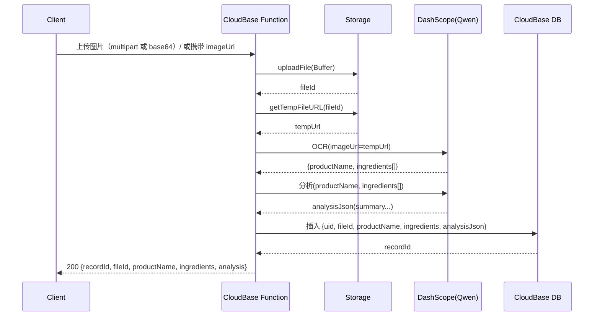

# 技术方案设计

## 架构概述

- 入口：CloudBase 云函数（Node.js 18.15），支持 SDK 调用与 HTTP 触发。
- 存储：CloudBase 存储，按 `productpicture/<uid>/<timestamp>_<random>.<ext>` 保存文件。
- 身份：在云函数内通过 `@cloudbase/node-sdk` 的 `app.auth().getUserInfo()` 获取 `uid` 进行绑定。
- OCR：调用通义千问多模态 OCR（与 `AISkin_backend-main/utils/ocrUtils.js` 提示词保持一致）。
- 成分分析：调用通义千问文本模型（与 `AISkin_backend-main/utils/ingredientAnalysisUtils.js` 提示词与字段保持一致）。
- 数据库：CloudBase 数据库集合 `product_ingredient_analysis` 保存 `{ uid, fileId, productName, ingredients[], analysisJson, createdAt }`。
- 安全：`API_KEY` 通过环境变量注入；不回显持久公共 URL，只返回临时链接或 `fileId`。

## 流程（同步）

## 技术选型

- 运行时：Node.js 18.15
- SDK：`@cloudbase/node-sdk`
- HTTP 体解析：`parse-multipart`（解析 CloudBase HTTP 触发 base64+boundary 的表单）+ JSON(Base64) 兼容
- HTTP 客户端：`axios`
- AI 模型：
  - OCR：`qwen-vl-ocr-2025-04-13`
  - 分析：`qwen-turbo-latest`

## 接口设计

- 函数名：`product_ingredient_analysis`
- HTTP 访问路径（示例）：`/product-ingredient-analysis`
- 请求：
  - `multipart/form-data` 字段名优先 `productImage`(兼容 `file`, `image`)
  - 或 `application/json`：`{ imageBase64: string, fileExtension?: 'jpg'|'jpeg'|'png' }`
  - 可选：`{ imageUrl: string }`（已上传文件，函数仅做 OCR+分析+入库）
- 响应：`{ recordId, fileId, imageTempUrl?, productName, ingredients, analysis }`

## 错误与超时

- 上传文件校验：类型 `jpg|jpeg|png`，大小 ≤ 5MB
- AI 请求超时：10s，每步各一次（OCR/分析）
- 超时/失败：返回 502/500，并记录 `requestId` 与最小上下文

## 安全与合规

- 认证：仅通过 CloudBase SDK 调用或已登录态的 HTTP 调用；函数内部使用 `app.auth().getUserInfo()` 获取 `uid`，不自实现登录
- 密钥：`API_KEY` 使用环境变量
- 数据脱敏：日志不打印完整 URL 与敏感内容

## 测试策略

- 单元：工具函数（扩展名判断、multipart 解析）
- 集成：模拟 event（JSON/base64/multipart）与成功/失败分支
- 端到端：实际上传小图测试流程 